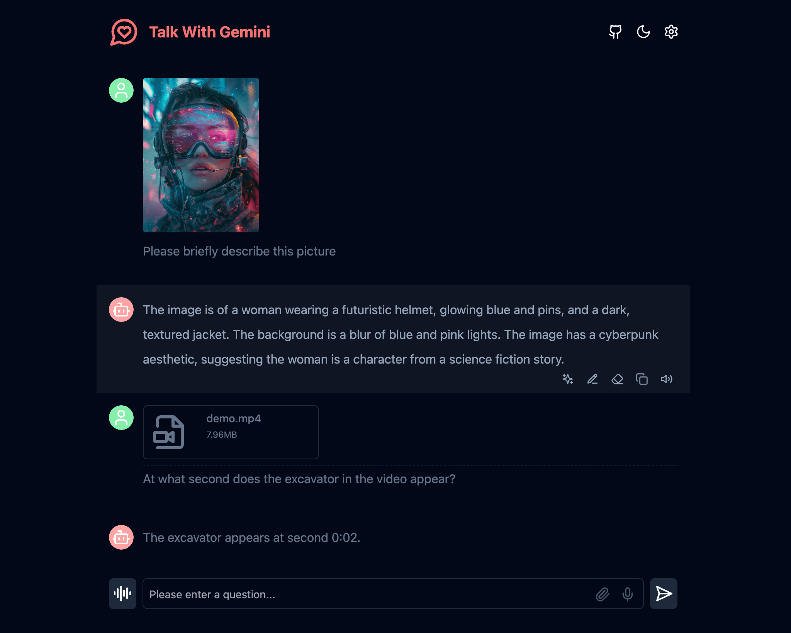
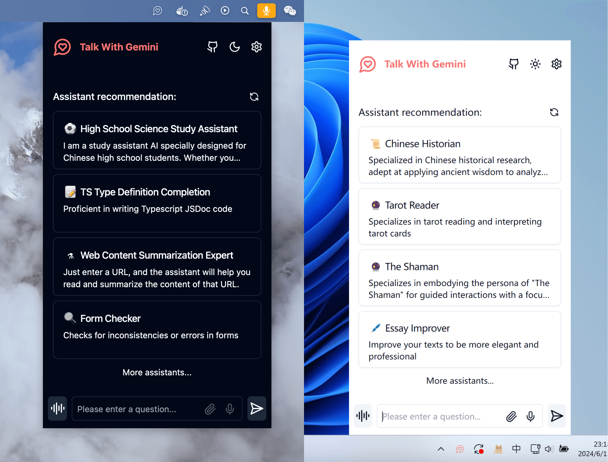

<h1 align="center">Talk With Gemini</h1>

Deploy your private Gemini application for free with one click, supporting Gemini 1.5 Pro, Gemini 1.5 Flash, Gemini Pro, and Gemini Pro Vision models.

[![Web][Web-image]][web-url]

[web-url]: https://gemini-ultra-iota.vercel.app/

A straightforward interface supporting image recognition and voice conversations.

Supports Gemini 1.5 and Gemini 1.5 Flash multimodal models.

A cross-platform application client with a persistent menu bar for enhanced productivity.

> Note: For troubleshooting during usage, refer to the known issues and solutions in the [FAQ](#FAQ) section.

## Features

- **One-Click Free Deployment** on Vercel in under 1 minute.
- Lightweight (~4MB) cross-platform client (Windows/MacOS/Linux) that can reside in the menu bar for improved office efficiency.
- Supports multimodal models capable of understanding images, videos, audios, and some text documents.
- Talk mode: Directly converse with Gemini.
- Visual recognition allows Gemini to interpret picture content.
- Assistant market featuring hundreds of curated system commands.
- Full Markdown support: LaTeX formulas, code highlighting, and more.
- Automatic compression of contextual chat records for extended conversations while conserving tokens.
- Privacy and security ensured with all data stored locally in the user's browser.
- Progressive Web App (PWA) support for standalone application functionality.
- Well-designed UI with responsive design and dark mode support.
- Extremely fast initial screen load time with support for streaming responses.
- Static deployment allows deployment on any service supporting static pages like GitHub Pages, Cloudflare, Vercel, etc.
- Multilingual support: English, Simplified Chinese, Traditional Chinese, Japanese, Korean, Spanish, German, French, Portuguese, Russian, and Arabic.

## Roadmap

- [x] Topic square reconstruction and introduction of Prompt list.
- [x] Use Tauri to package desktop applications.
- [ ] Implementation based on functionCall plugin.
- [ ] Support conversation list.

## Get Started

1. Obtain a [Gemini API Key](https://aistudio.google.com/app/apikey).
2. Click on the button below to deploy:
   []
3. Start using.

## Access Password

This project implements limited access control. Add an environment variable named `ACCESS_PASSWORD` on the Vercel environment variables page.

After adding or modifying this environment variable, redeploy the project for the changes to take effect.

## Custom Model List

Supports customization of model lists. Add an environment variable named `NEXT_PUBLIC_GEMINI_MODEL_LIST` in the `.env` file or on the environment variables page.

The default model list is represented by `all`, and multiple models are separated by `,`.

For adding a new model, either directly specify the model name `all,new-model-name`, or use the `+` symbol followed by the model name, e.g., `all,+new-model-name`.

To remove a model from the list, use the `-` symbol followed by the model name, e.g., `all,-existing-model-name`. Use `-all` to remove the default model list.

To set a default model, use the `@` symbol followed by the model name, e.g., `all,@default-model-name`.

## Environment Variables

Details about environment variables are provided in the sections of the README.

## Requirements

NodeJS >= 18, Docker >= 20

## Development

Instructions for development are detailed in the README.

## Deployment

Deployment methods are detailed in the README.

## FAQ

Frequently asked questions and their solutions are provided in the FAQ section of the README.

## Star History

View the star history of the project.

---

This version focuses on describing the application features, deployment options, and customization capabilities without including installation instructions.